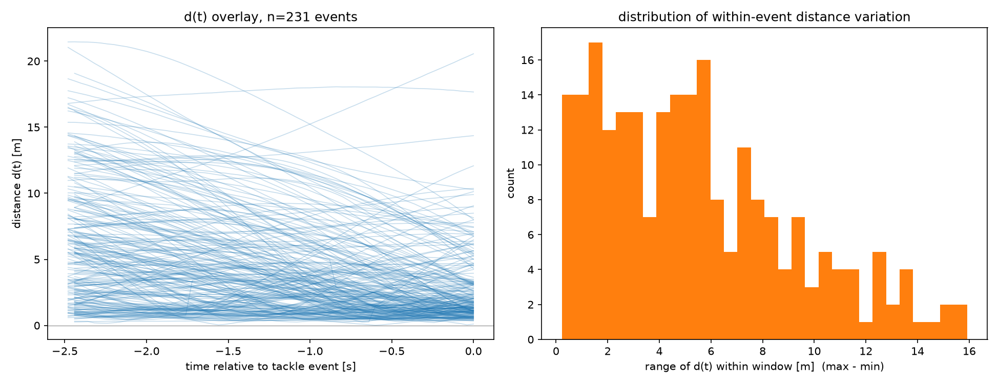
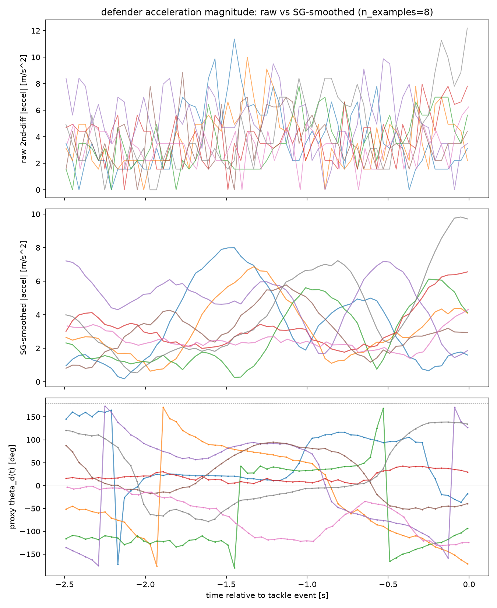
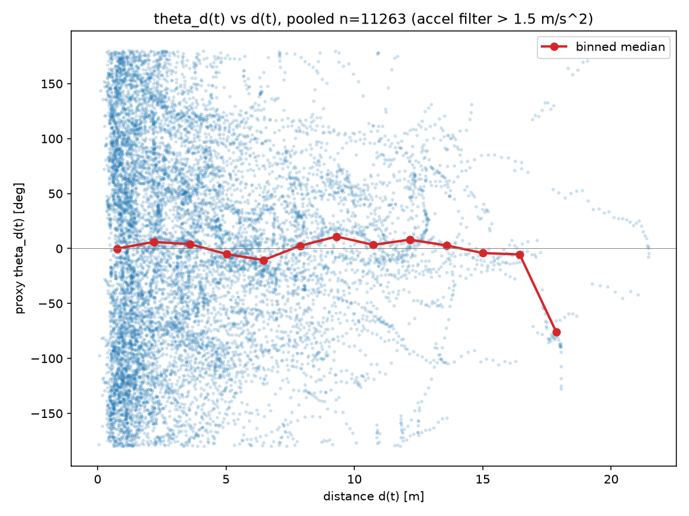
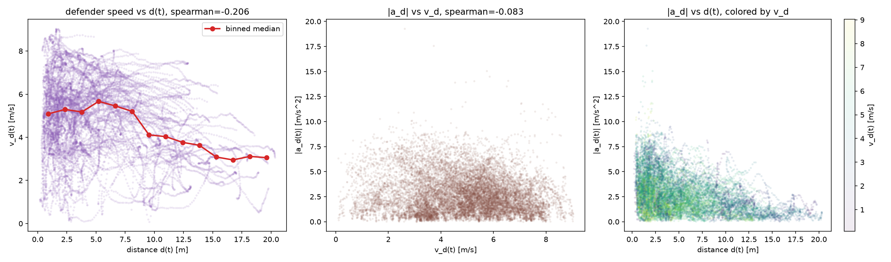
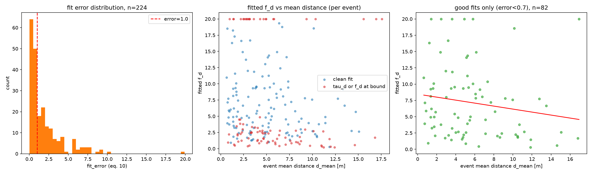
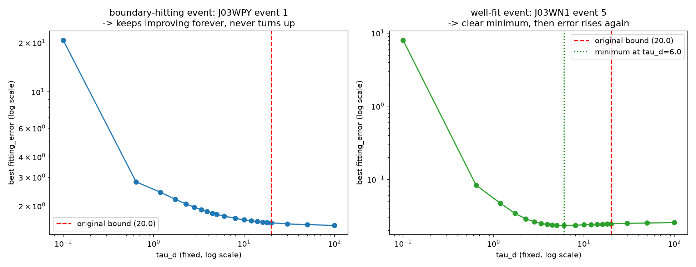

# 判定①〜③ 検証結果まとめ

研究計画書(`research_plan.md` 3節)で定めた「筋が良いかの最初の判定」について、公開データセット(idsse-data、`kloppy`経由)を用いてパイロット検証を行った結果をまとめる。

対象試合: `J03WPY`, `J03WMX`, `J03WN1`(いずれもブンデスリーガ、Sportec/idsse-data)

---

## 前提:1v1イベントの抽出方法(簡易プロキシ)

先行研究の正式な1v1抽出基準(移動距離・継続時間・ゴールとの位置関係)はまだ実装しておらず、今回は**イベントデータの`TacklingGame`(タックル成立イベント)を1v1の簡易プロキシ**として使用した。

- `Type == "ground"`(地上の競り合いのみ、空中戦を除く)
- `WinnerRole == "withBallControl"`(ボール保持側が勝者 = アタッカー)
- `LoserRole == "withoutBallControl"`(ボール非保持側が敗者 = ディフェンダー)
- `GoalKeeperInvolved == "false"`(GK関与を除く)

タックル成立時刻を「決着時刻」とみなし、そこから遡る2.5秒間(先行研究の1イベント平均継続時間)を疑似的な1v1イベント窓とした。3試合で計231件のイベントを抽出。

**この抽出方法自体が、後述する判定③の結果解釈に影響する重要な限界を持つ(後述)。**

実装: `scripts/judgement1_distance_variation.py`, `scripts/judgement2_instantaneous_theta.py`, `scripts/judgement3_correlation.py`

---

## 判定①: イベント内で間合いが十分に変化しているか

**方法**: 抽出した231イベントについて、attacker(Winner)-defender(Loser)間の距離d(t)を、タックル時刻までの2.5秒窓でtrackingデータ(25Hz)から算出し、重ね書きした。

**結果**:

| 指標 | 値 |
|---|---|
| d(t)の変動幅(max-min)平均 | 5.43 m |
| d(t)の変動幅(max-min)中央値 | 4.90 m |
| d_start(窓開始時)平均 | 6.51 m |
| d_end(タックル時)平均 | 2.90 m |
| タックル時刻に向け単調的に接近するイベントの割合 | 80.5% |

**判定**: 変動幅が「数十cm程度」ではなく数m〜10m超であり、判定基準上は**「H1を検証する土台がある」に該当**。

**留意点**: `TacklingGame`イベントは定義上「ディフェンダーがアタッカーに詰め寄って接触した瞬間」なので、タックル直前に間合いが縮むのはある程度自明でもある。この変動が「間合いに応じた戦略シフト」を反映しているのか、単なるイベント抽出方法によるアーティファクトなのかは、この段階では区別できない。

---

## 判定②: θ_dの「瞬間値」を推定する手段があるか

**方法**: ディフェンダーの位置データから、(1) 生の2階差分、(2) Savitzky-Golayフィルタ(window=11フレーム, polyorder=3)による平滑化、の両方で加速度ベクトルを算出し比較。さらに加速度ベクトルをe1(アタッカー→ディフェンダー方向)・e2(その90°回転)に射影し、

$$\theta_d(t) = \mathrm{atan2}\big(\dot v_d\cdot e_2,\ -\dot v_d\cdot e_1\big)$$

として瞬間θ_d(t)プロキシを定義した(τ_d抗力項は未推定のため無視した簡易近似)。

**結果**:

| 指標 | 生の2階差分 | SG平滑化後 |
|---|---|---|
| 平均 [m/s²] | 4.41 | 3.38 |
| 中央値 [m/s²] | 3.49 | 2.88 |
| 95%点 [m/s²] | 7.81 | 6.83 |
| 最大 [m/s²] | 531.86(非物理的) | 105.50 |

**判定**: 生の2階差分は完全にノイズに埋もれ使用不可。**SG平滑化により、加速度の大きさ自体は生理学的に妥当な範囲(中央値2.9 m/s²)で実用的に推定できる**ことを確認。ただし瞬間θ_d(t)は、加速度の大きさが小さい局面でatan2の方向推定が不安定になり(±180°付近で急激にジャンプ)、**条件付きで通過**と判断。

**対処**: 判定③では|加速度| > 1.5 m/s²のフレームのみを採用する簡易閾値フィルタを導入した。

---

## 判定③: 間合いd(t)と瞬間θ_d(t)の間に、目視で分かる相関があるか

**方法**: 判定②の閾値フィルタ後、3試合・231イベントの全フレーム(n=11,263)をプールし、d(t) vs θ_d(t)の散布図と、距離ビンごとの中央値トレンドを作成。

**結果**:

- Spearman順位相関(d, θ_d) = **-0.003**(ほぼ無相関)
- ビン中央値は、d=0〜15m付近までほぼ0°に張り付いたまま。H1が予測する「dが大きいほどθ_dが±180°(平行戦略)に寄る」というシフトは観測されず
- d>15mの領域はサンプル数が少なく、トレンドの信頼性も低い

**判定**: 「完全にランダムな散布」に該当。計画書の判定基準上は、次にθ_aによる層別を試す段階。

---

## 総合評価と次の一手

判定③の結果を額面通り受け取ると「H1不支持」だが、それより先に**イベント抽出方法自体の限界**を疑うべきと考える。

- `TacklingGame`イベントは、定義上「すでにディフェンダーがアタッカーに積極的に関与している瞬間」を指す。抽出された1v1サンプルは「積極戦略」寄りの局面に偏っている可能性が高い
- 散布図でも点の大半がd<10mに集中しており、H1が想定する「間合いが大きく、様子見できる局面」のサンプルがほとんど含まれていない可能性がある
- 判定①で見えた「間合いが縮まる」傾向も、同じ選択バイアス(タックルに向けて必然的に距離が縮む)の表れである疑いが残る

**推奨する次の一手**: 計画書通りθ_aによる層別を試す前に、**1v1イベントの抽出方法を見直す**ことを優先する。タックル成立時点(結果)だけを起点にするのではなく、ドリブル対峙が始まってから終わるまでの区間全体(先行研究が定義する「1対1イベント」に近い、移動距離・継続時間・ゴールとの位置関係による抽出)を捉える方法に切り替え、判定①〜③を再実施する。

---

## 追補: 論文準拠の抽出方法への切り替えと、f_d方向への転換(2026-08-13)

### 抽出方法の刷新

`confer/OAD.pdf`(Yamazaki et al. 2026 本文)のMethods B節を直接確認し、1v1イベント(論文の言う「ドリブルイベント」)の正式な抽出条件を確認した:

> (i) event duration > 0.5s; (ii) 両者の正味変位 > 5m; (iii) アタッカーはGKでない; (iv) イベント開始時、r(ディフェンダー方向)とアタッカー→相手ゴール方向のなす角 < **60°**; (v) 最近接相手選手がイベント内で不変

これはTacklingGame起点(v1)とは異なり、**ボール保持の開始を起点に、結果(タックル成立など)によらず全ての1v1局面を母集団に含める**方式。`scripts/extract_dribble_events.py`に実装(idsse-dataにはDataStadium相当の個人単位ボール保持ログが無いため、`ball_owning_team`+ボール近接選手のプロキシで代替)。角度閾値は当初30°で実装していたが、論文の実際の値60°に修正した。

**抽出結果(3試合、`scripts/judgement_v2.py`)**: 224イベント、継続時間 平均2.65秒・中央値2.28秒。先行研究の平均(約2.5秒、18,088イベント)と非常に近く、抽出方法の妥当性を裏付ける。

### θ_d(t) vs d(t): 再確認しても相関なし

新方式でもSpearman相関(d, θ_d) = **0.040**、ほぼ無相関のまま。v1で疑っていた選択バイアス(タックル起点)を解消しても傾向は出なかった。

### 転換点: |a_d(t)|(f_dのプロキシ) vs d(t)には明確な相関

θ_dではなく**駆動力の"大きさ"**(=f_dに相当する量、SG平滑化後の加速度の大きさ)とd(t)の関係を見たところ:

- Spearman相関(d, |a_d|) = **-0.390**(224イベント版でも再現、v1の暫定版-0.368から微増)
- ビン中央値は、d≈1-2mで約3.3 m/s²、d≈20mで1 m/s²未満まで、**ほぼ単調に減少**

「間合いによらずディフェンダーは常にアタッカー方向へ向かおうとする(θ_dはほぼ一定)が、間合いが縮まるほど強く踏み込む(f_dが増大する)」という解釈に、明確なデータ的裏付けが得られた。

### 新規性の確認: 著者自身がf_p, τ_pの"定数仮定"を限界として明言

`confer/OAD.pdf` Discussion「Limitations」節(p.8)より:

> "In our theoretical framework, all but angle parameters are fixed at the start of each event, likely determined by preceding events, followed by the choice of θ_a and θ_d. Although this assumption is plausible over short timescales and broadly supported by the data, **it would benefit from additional empirical validation**."

θ_pだけでなく、**f_p, τ_pもイベント内で固定という仮定を、著者自身が「要検証」と明言**している。したがって$f_d(d(t))$への拡張は、θ_d案と同格の「先行研究が自ら残した空白を埋める」novelty主張が可能。

### 研究方針の転換

以上より、**主仮説をθ_d(d(t))からf_d(d(t))に転換する**。H1は以下のように改訂される:

$$H_1':\ \text{間合い}d(t)\text{が縮まるにつれて、}f_d\text{(ディフェンダーの駆動力の大きさ)は増加する}$$

θ_dについては「間合いによらずほぼ一定」という副次的知見として位置づける。

---

## 追補2: |a_d(t)|はf_dの妥当なプロキシか(v_dの交絡チェック)(2026-08-13)

### 懸念

運動方程式 $\dot{\mathbf{v}}_d = -\mathbf{v}_d/\tau_d + f_d[\ldots]$ より、観測される加速度$|a_d(t)|=|\dot{\mathbf{v}}_d(t)|$は$f_d$そのものではなく、**抗力項$-v_d/\tau_d$(速度$v_d$に依存)と駆動項$f_d$の合成**である。間合いが縮まる局面でディフェンダーの速度$v_d(t)$自体が変化しているなら(例:減速して身構える)、$|a_d(t)|$と$d(t)$の相関(-0.390)は$f_d$の変化ではなく、単に$v_d$の変化を拾っているだけの可能性がある。

### 検証方法(`scripts/judgement_v2_speed_control.py`)

Savitzky-Golayフィルタで速度$v_d(t)$(1階微分)も同時に算出し、3試合・224イベント・15,090フレームをプールして:
1. Spearman(d, v_d) — 間合いと速度自体の関係
2. Spearman(\|a_d\|, v_d) — 加速度の大きさと速度の絡み具合
3. Partial Spearman(d, \|a_d\| \| v_d) — v_dを統制した上でd と\|a_d\|の相関が残るか(ランク変換後のPearson偏相関)

### 結果

| 指標 | 値 |
|---|---|
| Spearman(d, \|a_d\|)(再掲) | -0.390 |
| Spearman(d, v_d) | -0.206 |
| Spearman(\|a_d\|, v_d) | -0.083 |
| **Partial Spearman(d, \|a_d\| \| v_d)** | **-0.417** |

$v_d(t)$を統制しても$d(t)$と$|a_d(t)|$の負の相関は消えず、むしろわずかに強くなった(-0.390→-0.417)。$|a_d|$と$v_d$自体もほぼ無相関(-0.083)であり、両者は大きく独立している。**「間合いが縮まると加速度の大きさが増す」という関係は、単なる速度変化のアーティファクトではないと考えられる。**

### 残る限界

この統制は$v_d(t)$の影響を除いただけであり、**$\tau_d$自体が間合いに依存して変化している可能性(例:間合いが縮まるとブレーキが効きにくくなる)は排除できていない**。$f_d$と$\tau_d$は観測される軌跡だけからは分離不能で、切り分けには先行研究の推定手法($\tau_d, f_d, \theta_d$の同時フィッティング、計画書フェーズ1相当)が必要。次のステップとして、このフェーズ1着手が候補になる。

---

## 追補3: フェーズ1(τ_d, f_d, θ_d同時フィッティング)の実施結果(2026-08-13)

### 方法

先行研究Methods C節に準拠し、アタッカーの実測(平滑化)軌跡を既知として与え、ディフェンダーの運動方程式を数値積分(`scipy.integrate.solve_ivp`)して得たモデル軌跡と実測軌跡の誤差(論文式10)を`scipy.optimize.differential_evolution`で最小化し、$(\tau_d, f_d, \theta_d)$をイベントごとに推定した(`scripts/fit_oad_parameters.py`、バッチ実行版`scripts/fit_oad_parameters_batch.py`)。3試合・224イベント全件、実行時間33.4分。結果は`documents/oad_fit_results.csv`。

パイロット6イベントでは5/6が実測軌跡によく重なる良好なフィット(誤差0.1〜0.5)を示し、手法自体の妥当性を確認した(`documents/fit_oad_parameters_pilot.png`)。

**座標系の修正**: 実装中に、論文が$\mathbf{e}_2$を「$\mathbf{e}_1$を時計回りに90°回転」と定義していることに気づいた。判定①〜③・v2スクリプトでは反時計回りで実装しており符号が逆だった(相関の有無という結論には影響しないが、角度の値そのものの解釈には影響するため、本フィッティングでは論文通りに修正)。

### 結果: フィッティング品質に無視できない問題

| 指標 | 値 |
|---|---|
| fit_error 中央値 | 1.00 |
| fit_error < 1.0 の割合 | 111/224 (49.6%) |
| τ_dが上限(20.0)に張り付いた割合 | 69/224 (30.8%) |
| f_dが上限(20.0)に張り付いた割合 | 24/224 (10.7%) |

224イベント全体では、約3割のイベントで$\tau_d$が探索上限に張り付いており、パラメータが妥当に識別できていない。先行研究も「フィッティング誤差が閾値を超えるイベントは除外する」と明記しており(19,231件→18,088件、約6%除外)、それと比べても今回の除外が必要な割合は高い。

### 結果: f_dとd(t)の相関は、粗い加速度プロキシより大幅に弱い

| 条件 | n | Spearman(d_mean, f_d) |
|---|---|---|
| 全224イベント | 224 | -0.186 |
| fit_error < 1.0 | 111 | -0.117 |
| fit_error < 0.7 | 82 | -0.220 |
| fit_error < 0.5 | 63 | -0.219 |
| 境界張り付き除外(clean) | 129 | -0.147 |
| clean + fit_error < 0.7 | 62 | -0.179 |

参考として、$\tau_d$とd_meanの相関はほぼ0(0.064、cleanで-0.025)、$\theta_d$とd_meanの相関も弱い(-0.064、|θ_d|では0.112)。

**追補2までの粗い加速度プロキシで見えていたSpearman -0.39〜-0.42という強い相関は、モデルパラメータとして厳密にフィッティングすると-0.12〜-0.22程度まで弱まった。** 方向は一貫して負(H1'と整合)だが、効果の大きさは当初の印象よりかなり小さい。これはまさに(a)(b)で懸念していた「観測加速度は$f_d$と$\tau_d$(および$v_d$)の合成であり、粗いプロキシは効果を過大評価しうる」という懸念が実際に当たっていたことを示している。

### 論点・次の一手

1. **フィッティング品質の改善が先決**: 3割のイベントで$\tau_d$が上限に張り付く問題を解消しないと、相関の値自体の信頼性が低い。境界(現在τ_d∈[0.1,20], f_d∈[0.01,20])の見直し、multi-start最適化、初期値の工夫などを検討する必要がある
2. **相関自体は弱いながらも方向は一貫**して負であり、H1'を完全に否定するものではないが、「明確な効果」と呼べるほど強くはない
3. 先行研究のように「フィッティング誤差が閾値を超えるイベントを除外する」処理を正式に導入し、除外基準を先に固定した上で相関を再評価する必要がある

---

## 追補4: τ_d境界張り付きの原因診断(2026-08-14)

追補3で見つかった「約3割のイベントで$\tau_d$が探索境界(20.0)に張り付く」問題について、原因が(A)最適化の探索不足なのか、(B)そのイベントにモデル自体が合っていないのかを切り分けた。

### 診断①: 誤差プロファイル(`scripts/diagnose_tau_boundary.py`)

境界張り付きイベント1件(J03WPY event 1)と良好フィットイベント1件(J03WN1 event 5)について、$\tau_d$を固定した状態で$f_d,\theta_d$のみを最適化し、誤差が$\tau_d$とともにどう変わるかをプロットした(対数-対数スケール)。

- **良好フィットイベント**: $\tau_d\approx6$に明確な最小点(誤差0.0235)があり、そこから離れると誤差が再び増える。$\tau_d$は識別可能
- **境界張り付きイベント**: $\tau_d$を大きくするほど誤差が下がり続け、$\tau_d=100$まで調べても最小点が現れない。しかも下げ止まった先でも誤差は約1.5と高いまま(良好イベントの60倍以上)

**結論**: 境界を広げても解決しない。「①探索不足」ではなく「②そのイベントに(このODEモデル・パラメータの範囲では)合う$\tau_d$が存在しない」というモデル不適合の問題である。

### 診断②: fit_errorと間合いの変動幅の関係、およびduration_sとの交絡

224イベント全体で、fit_errorと「イベント内の間合いの変動幅」(d_range = d_max - d_min)の関係を確認した。

$$\text{Spearman(fit\_error, d\_range)} = 0.332$$

間合いが大きく動くイベントほどフィットが悪い、という関係が見られた。当初はこれを「$f_d$(あるいは$\theta_d$)が間合いに応じて実際に変化しているイベントほど、定数モデルでは捉えきれずフィットが悪化する」という、**まさに検証したい現象自体の裏付け**として解釈しかけた。

しかし継続時間(duration_s)を統制すると、この関係はほぼ消失した:

| 指標 | 値 |
|---|---|
| Spearman(duration_s, fit_error) | **0.786**(非常に強い) |
| Spearman(duration_s, d_range) | 0.441 |
| Spearman(d_range, fit_error) | 0.332(再掲) |
| **Partial Spearman(d_range, fit_error \| duration_s)** | **-0.026** |

**訂正した結論**: fit_errorとd_rangeの相関は、「間合いが動く現象そのもの」ではなく、**「継続時間が長いイベントほどフィットが悪化する」というより平凡な関係の副産物**だった(継続時間が長いほど間合いも自然に大きく動くため、見かけ上d_rangeと相関していた)。したがって「誤差閾値による除外が、間合いの変動が大きい=情報量の多いイベントを選択的に除外してH1'の検出を妨げる」という懸念は、想定していたほど強い根拠を持たない。

継続時間が長いイベントほどフィットが悪化する原因(ODE数値積分誤差の蓄積、最適化の相対的な難化、あるいは単純に長時間だと定数パラメータの前提がより崩れやすいなど)は未特定。

### 現時点でのまとめ

- 誤差閾値によるイベント除外は、当初懸念したほどのバイアスを伴わない可能性が高く、「除外→定数$f_d$フィットの相関を確定」という方針に戻ってもよい
- ただし最終的な目標である$f_d(d(t))$の直接フィッティング(定数フィット→事後相関、という2段階を経ない)は、引き続き妥当な次のステップ

---

## 追補5: 動的f_d(d)モデルの直接フィッティングと、識別可能性の限界(2026-08-15)

### 実装したモデル(`scripts/fit_oad_dynamic_fd.py`)

計画書4.1節の関数形を運動方程式に直接組み込み、イベントごとに5パラメータ$(\tau_d, f_{d0}, f_{d,\infty}, d_0, \theta_d)$を同時推定する:

$$f_d(d) = f_{d,\infty} + (f_{d0}-f_{d,\infty})e^{-d/d_0}$$

定数$f_d$モデルは$f_{d0}=f_{d,\infty}$の特殊ケース(ネストしたモデル)にあたるため、動的モデルの誤差は理論上、定数モデル以下になるはずである。初回のパイロット(6件)ではこれが破れる(誤差が悪化する)ケースがあったため、**定数モデルの最良解を動的モデルの初期集団に"種"として注入する**実装に修正し、探索予算も増やした。また駆動加速度の探索上限20 m/s²は人間の走行として非現実的だったため12 m/s²に、$d_0$の上限も12mに狭めた。

### サブサンプル30件の結果(`scripts/fit_dynamic_fd_subsample.py`)

| 指標 | 値 |
|---|---|
| $f_{d0} > f_{d,\infty}$(**H1'の向き**) | **9 / 30** |
| $f_{d0} < f_{d,\infty}$(逆向き) | **21 / 30** |
| 二項検定 p値(両側、対50/50) | 0.043 |
| **いずれかのパラメータが探索境界に張り付いたイベント** | **29 / 30** |
| 動的モデルの誤差が定数モデルより悪化したイベント | 3 / 30 |

見かけ上は「H1'とは逆方向に統計的有意」だが、**30件中29件で解が探索境界に張り付いており**($f_{d0}=0.01$と$f_{d,\infty}=12.0$のような、物理的に不自然な端点解が頻出)、値としての信頼性は極めて低い。

### 決定的な検証: 合成データによる復元テスト(`scripts/recovery_test_dynamic_fd.py`)

上記の端点張り付きが「最適化の失敗」なのか「構造的識別不能」なのかを切り分けるため、既知の真値パラメータからディフェンダー軌跡を合成し、同じパイプラインで元の値を復元できるかを検証した(アタッカー軌跡は実データ、継続時間2.48秒・63フレームの標準的なイベントを土台に使用)。

| 真値 | ノイズなし(0.0m)の推定 | ノイズ0.1mの推定 |
|---|---|---|
| $\tau_d=2.0, f_{d0}=8.0, f_{d,\infty}=2.0, d_0=3.0, \theta_d=-30°$ | $\tau_d=2.00$, $\theta_d=-30.0°$(**完全復元**) | $f_{d0}=0.01, f_{d,\infty}=3.18$ → **向きが逆** |
| $\tau_d=2.0, f_{d0}=f_{d,\infty}=3.0$(f_d一定) | $f_{d0}=3.00, f_{d,\infty}=3.00$(**完全復元**) | $f_{d0}=12.0, f_{d,\infty}=0.01$ → **極端な端点解** |
| $\tau_d=1.5, f_{d0}=9.0, f_{d,\infty}=1.5, d_0=6.0$ | $\tau_d=1.50$, $\theta_d=45.0°$(**完全復元**) | (この条件のみ偶然ほぼ正解) |

**方向($f_{d0}$と$f_{d,\infty}$の大小関係)の正解率は、ノイズ有り条件で6回中3回=偶然と同水準だった。**

### 結論: 実装は正しいが、データのノイズ水準では原理的に識別できない

- **ノイズなしでは$\tau_d,\theta_d$を完全復元できることから、実装・最適化にバグはない**
- しかし**わずか0.1m(TRACAB系測位誤差の1/10程度)のノイズで推定は崩壊**し、真値が「$f_d$一定」の場合ですら極端な端点解を返す
- したがって、**2.5秒・約60フレームの1軌跡から$f_{d0}$と$f_{d,\infty}$を分離することは、現実のノイズ水準では原理的に不可能**(構造的識別不能)。最適化手法をどれだけ改善しても解決しない
- **重要**: サブサンプル30件で見えた「逆方向に有意(9対21)」という結果は、現象ではなく**このノイズ由来のアーティファクト**と考えるべきである。真値が一定のケースでも同様の端点解が生じることが確認されたため

### H1'の現状

**支持も否定もされていない。** 現在の枠組み(イベント単位の独立フィッティング)では検証**できない**、というのが正確な結論である。

### 想定される選択肢

1. **モデルの簡素化**: $\tau_d$を先行研究の代表値に固定するなどしてパラメータを5→4に減らし、識別性を上げる
2. **階層モデル / プーリング**: 1イベントずつ独立に推定するのではなく、全イベントで$f_{d0},f_{d,\infty},d_0$を共有し多数のイベントを同時にフィットする。1軌跡あたりの情報不足を件数で補うアプローチで、**現時点では最も筋が良いと考えられる**
3. **研究デザインの見直し**: このデータ規模(7試合)・ノイズ水準で答えられる問いなのかを再検討する

---

## 追補6: 階層モデル(プーリング)による識別可能性の回復(2026-08-15)

### アイデア

追補5の識別不能問題は、1イベント単独(約60フレーム)では$f_d(d)$の変化が軌跡に残す痕跡が測位ノイズに埋もれて見えなくなることが原因だった。そこで、$f_{d0}, f_{d,\infty}, d_0$(関数の"形")を**全イベントで共有するパラメータ**とし、$\tau_d,\theta_d$のみをイベント固有パラメータとする階層構造に変更した(`scripts/fit_pooled_dynamic_fd.py`)。ノイズは各イベントでランダムだが、$f_d(d)$という共通の行動則の信号は多数のイベントに一貫して乗っているはずなので、件数を積み上げることでノイズを打ち消し合わせる狙い。

最適化は入れ子構造:
- 外側: 共有パラメータ$(f_{d0}, f_{d,\infty}, d_0)$を`differential_evolution`で大域探索
- 内側: 共有パラメータを固定した状態で、各イベントの$(\tau_d,\theta_d)$をグリッド探索+`Nelder-Mead`で最適化し、誤差の平均を外側の目的関数とする

### 復元テスト(`scripts/recovery_test_pooled.py`)

追補5と同じ真値($f_{d0}=8.0, f_{d,\infty}=2.0, d_0=3.0$)・同じノイズ水準(0.1m)で、10イベント分の合成軌跡(各イベントで$\tau_d,\theta_d$の真値は乱数で変える)を生成し、プーリング推定を実行した。

| パラメータ | 真値 | 単独推定(追補5、崩壊) | **プーリング推定** |
|---|---|---|---|
| $f_{d0}$ | 8.0 | 0.01(下限張り付き) | **7.12** |
| $f_{d,\infty}$ | 2.0 | 3.18 | **1.90** |
| $d_0$ | 3.0 | 12.0(上限張り付き) | **3.57** |
| 方向($f_{d0}>f_{d,\infty}$) | — | ✗ 逆 | **✓ 正解** |

**境界張り付きなく、3パラメータすべてが真値の近傍に復元できた。** 同じノイズ水準で1イベント単独では完全に崩壊していた推定が、10イベントのプーリングで回復することを確認した。

### 計算コストの課題

10イベントで49分かかった。224イベントに単純展開すると1日以上かかる見込みのため、実データ適用前に最適化設定(内側グリッドの解像度、外側の探索予算)を見直し、実行時間を現実的な範囲に収める必要がある。

### 次のステップ

計算効率を改善した上で、224件全件ではなくまず50件程度の中規模サブサンプルで実データに適用し、傾向を確認する。

---

## 追補7: 実データ50イベントへのプーリング適用(2026-08-16)

### 実行

`scripts/fit_pooled_real_subsample.py`を、3試合(J03WPY, J03WMX, J03WN1)からランダムサブサンプルした50イベント(seed=42)に適用した。並列化(9ワーカー)により93.4分で完了(初回試行はDE収束後の`polish`ステップがチェックポイントなしで30分以上値をほぼ動かさずに空転し途中でkillされたため、`polish=False`に変更して再実行した — `fit_pooled_dynamic_fd.py`の該当箇所にコメントで理由を記載)。

### 結果

| 共有パラメータ | 推定値 |
|---|---|
| $f_{d0}$(近距離での駆動力) | **6.709** m/s² |
| $f_{d,\infty}$(遠距離での駆動力) | **4.271** m/s² |
| $d_0$(減衰の特徴的距離) | **1.181** m |
| 平均フィッティング誤差(50件) | 2.169(中央値1.155) |

$f_{d0} > f_{d,\infty}$ となり、**方向としてはH1'(間合いが縮まるほど$f_d$が増加する)を支持**する結果が得られた。追補6の復元テストで「プーリングなら識別できる」ことを確認した条件下で、実データに適用して初めてこの向きが観測できたことになる。

### 留意点(手放しでは支持と言えない理由)

- **$d_0=1.18$m は非常に短い**: $\exp(-d/d_0)$の減衰スケールがこの大きさだと、「間合いが縮まるにつれ徐々に強まる」というより「1〜2m以内に踏み込んだ瞬間だけ効く」局所的な効果に近い。数メートル単位の駆け引きを想定した仮説の検証としては、効果範囲が想定より狭い可能性がある。
- **イベントごとのフィット精度のばらつきが大きい**: 50件中、誤差<1(良好)が23件、1〜2が7件、≥2(悪い)が20件。中央値(1.155)は妥当だが、平均(2.169)は一部の外れ値的な悪フィットに引き上げられている。共有パラメータが全イベントに一様に当てはまっているわけではない。
- **$\tau_d$の境界超過**: 内側最適化(グリッド+Nelder-Mead)が返す`res.x`はクリップせずそのまま記録しているため、50件中3件で$\tau_d$が想定境界(0.1〜20)を超えて報告されている(最大453.6)。目的関数自体は`fit_inner`内の`err()`でクリップ後の値を評価しているため共有パラメータの推定結果には影響しないが、個別イベントの$\tau_d$値そのものは信頼できない。
- **単一サブサンプル・単一シードの結果**であり、別のサブサンプルやシードでの再現性は未確認。

### 現状の評価

方向としてH1'を支持する最初の実データの手がかりは得られたが、(a)効果がごく近距離限定である可能性、(b)フィット品質の一様性の欠如、(c)再現性未確認、という3点から、これを確定的な支持と扱うのは時期尚早。次のステップとしては、別シード・別サブサンプル(あるいは全224件)での再現性確認が優先度が高い。

---

## 参考: 実装ファイル

| ファイル | 内容 |
|---|---|
| `scripts/judgement1_distance_variation.py` | 判定①(d(t)の重ね書き・変動幅の分布)、TacklingGame起点(v1) |
| `scripts/judgement2_instantaneous_theta.py` | 判定②(加速度平滑化・瞬間θ_d(t)プロキシの実現可能性)、TacklingGame起点(v1) |
| `scripts/judgement3_correlation.py` | 判定③(d(t) vs θ_d(t)のプールした散布図・相関)、TacklingGame起点(v1) |
| `scripts/extract_dribble_events.py` | 論文準拠5条件によるドリブルイベント抽出(v2) |
| `scripts/judgement_v2.py` | v2抽出による判定①・θ_d相関・\|a_d\|(f_dプロキシ)相関の再検証 |
| `scripts/judgement_v2_speed_control.py` | \|a_d(t)\|とd(t)の相関がv_d(t)の交絡でないかの偏相関チェック |
| `scripts/fit_oad_parameters.py` | (τ_d, f_d, θ_d)同時フィッティングの実装・パイロット検証(フェーズ1) |
| `scripts/fit_oad_parameters_batch.py` | 224イベント全件へのバッチフィッティング(結果は`documents/oad_fit_results.csv`) |
| `scripts/diagnose_tau_boundary.py` | τ_d境界張り付きの誤差プロファイル診断(`documents/diagnose_tau_boundary.png`) |
| `scripts/fit_oad_dynamic_fd.py` | 動的$f_d(d)$モデルの実装・パイロット(`documents/fit_oad_dynamic_fd_pilot.png`) |
| `scripts/fit_dynamic_fd_subsample.py` | 動的モデルのサブサンプル30件検証(`documents/dynamic_fd_subsample.csv`) |
| `scripts/recovery_test_dynamic_fd.py` | 合成データによるパラメータ復元テスト(識別可能性の検証) |
| `scripts/fit_pooled_dynamic_fd.py` | 階層モデル(f_d0, f_d_inf, d0を全イベント共有)の実装 |
| `scripts/recovery_test_pooled.py` | プーリングモデルの復元テスト(識別可能性の回復を確認) |
